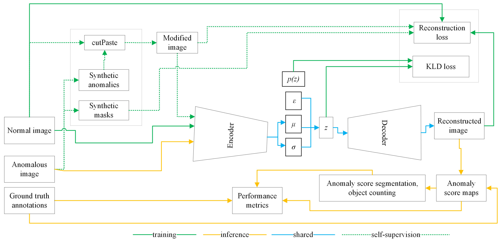

# SSL-VAE
This is the implementation of code used for [Self-Supervised Variational Autoencoder for Unsupervised Object Counting from Very-High-Resolution Satellite Imagery: Applications in Dwelling Extraction in FDP Settlement Areas](https://doi.org/10.1109/TGRS.2023.3345179) where the approach follows an anomaly detection approach with self-supervision. The approach is summarized in the workflow Figure below.



## Usage

To train a model
```
sh ae_train.sh
```

To test a model
```
sh ae_test.sh 
```

where specific parameters could be changed after opening the files
for feature space plot 
```
python automate_feature_space_plot.py --data_root ./root2data --save_dir ./root2save
```

This repository also contains re-impkementations of the following research works whose re-implkementations are reported for specific task in our study
- [PaDiM: A patch distribution modeling framework for anomaly detection and localization](https://doi.org/10.1007/978-3-030-68799-1_35) where the core implementation is forked from [codebase](https://github.com/xiahaifeng1995/PaDiM-Anomaly-Detection-Localization-master/tree/main) and adapted to our specific dataset
  ```
  python reimplementation/PADIM_all.py ----save_path /path2save --root /path2data --arch wide_resnet50_2
  ```
- [Sub-Image Anomaly Detection with Deep Pyramid Correspondences](https://arxiv.org/pdf/2005.02357) whose implementation is forked from [codebase](https://github.com/byungjae89/SPADE-pytorch/tree/master)
  ```
  python reimplementation/SPADE_all.py --top_k 5 --save_path /path2data --root /root2data
  ```
- [Counting sea lions and elephants from aerial photography using deep learning with density map](https://doi.org/10.1186/s40317-021-00247-x)
  
  ```
  python reimplementation/train_unet_alls.py  --save_path --root /path2data --sigma 5 --lr 0.0001 --epochs 50 --batch_size 4
  ```
- [Self-supervised training with autoencoders for visual anomaly detection](https://arxiv.org/abs/2206.11723) and
- [Towards visually explaining variational autoencoders](https://openaccess.thecvf.com/content_CVPR_2020/papers/Liu_Towards_Visually_Explaining_Variational_Autoencoders_CVPR_2020_paper.pdf)
